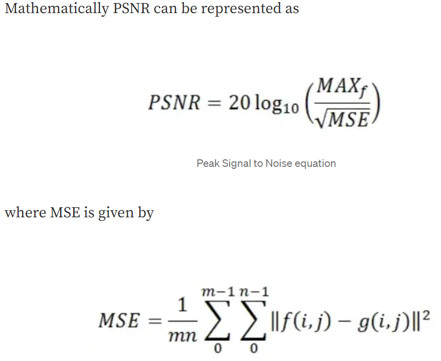

# Noise Detector 

## Detect noise levels in images 

- Gaussian Noise - Noise having PDF equal to the normal distribution. 
i.e. the pixel values that these noises can take are Gaussian distributed.

- Impulse Noise - caused by sharp and sudden disturbances in the image signal. 
It usually occurs as white and black pixels in the image.

real-world noise (also known as blind noise)

## Video Quality Metrics

1. full-reference (FR) require full access to the reference video. 

- Signal-to-Noise Ratio (SNR)
- Peak Signal-to-Noise Ratio (PSNR) 
- Mean Squared Error (MSE), Structural SIMilarity (SSIM) 
- Visual Information Fidelity (VIF) 
- VSNR 
- Video Quality Metric tools (VQM)

2. reduced-reference (RR) techniques which need a set of coarse features extracted from the reference video.

## References 

- taking sample 
https://yari-demos.prod.mdn.mozit.cloud/en-US/docs/Web/API/Media_Capture_and_Streams_API/Taking_still_photos/_sample_.demo.html